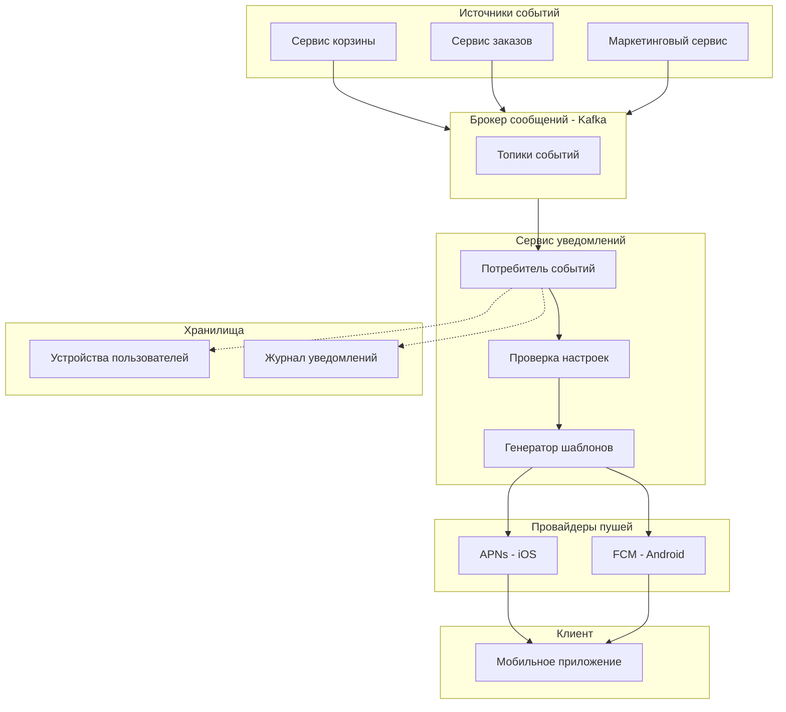

# petrushka_green_sa_test
Тестовое задание на позицию Junior системный аналитик. Решение заданий по анализу требований, проектированию API и архитектуре PUSH-уведомлений.

## Задание 1. Анализ требований к функционалу "Корзина"

###  Контекст

Фрагмент технического задания на разработку функционала корзины для интернет-магазина "Петрушка Зеленая". В ТЗ обнаружены логические противоречия, недочёты и неполные места.

**Исходное ТЗ:**

**1.** Пользователь может добавить в корзину от 1 до 10 единиц одного товара.

**2.** Пользователь может изменить количество каждого товара в корзине не менее, чем до 1-го. Для удаления товара из корзины используется отдельная кнопка.

**3.** В корзине может находиться не более 5 различных товаров.

**4.** Суммарное количество всех товаров в корзине не может превышать 20 штук.

**5.** Товары в корзине могут быть разные.

**6.** При попытке добавить товар, превышающий лимиты, система показывает сообщение: "Лимит корзины превышен".

**7.** Цена на продукт фиксируется на момент добавления в корзину и не меняется.

**8.** На странице корзины отображается список товаров, их количество, цена за единицу и общая стоимость позиции.

**9.** Если пользователь уменьшает количество товара до 0, товар удаляется из корзины.

**10.** В корзине может быть реклама других продуктов.

**11.** Реклама товаров в корзине должна быть каждый будний день по утрам и вечерам.

**13.** Если цена на товар изменилась в каталоге, система должна автоматически обновить ее в корзине у всех пользователей.

---

### 1.1. Найденные противоречия и недочёты

#### 🔴 Логические противоречия

| № | Пункты ТЗ | Суть противоречия |
|---|-----------|-------------------|
| 1 | **п.2 vs п.9** | п.2: *"Для удаления товара из корзины используется отдельная кнопка"* — удаление только кнопкой. п.9: *"Если пользователь уменьшает количество товара до 0, товар удаляется из корзины"* — удаление через обнуление количества. **Два взаимоисключающих механизма удаления.** |
| 2 | **п.7 vs п.13** | п.7: *"Цена на продукт фиксируется на момент добавления в корзину и не меняется"*. п.13: *"Если цена на товар изменилась в каталоге, система должна автоматически обновить ее в корзине у всех пользователей"*. **Прямое противоречие: цена и не меняется, и меняется.** |

#### 🟡 Недочёты и неполные места

| № | Пункт ТЗ | Проблема |
|---|----------|----------|
| 3 | **п.5** | *"Товары в корзине могут быть разные"* — тривиальное утверждение, не несёт бизнес-смысла и требований к разработке. |
| 4 | **п.11** | *"по утрам и вечерам"* — не указаны конкретные временные интервалы (что такое "утро"? что такое "вечер"?) и не указан часовой пояс (серверный или пользователя). |
| 5 | **п.10** | *"реклама других продуктов"* — не определено: каких именно продуктов, по какому алгоритму подбора (популярные, похожие, со скидкой), откуда берутся данные. |
| 6 | **п.6** | Сообщение *"Лимит корзины превышен"* — слишком общее. Пользователь не понимает, какой именно лимит нарушен (5 товаров? 10 единиц одного вида? 20 суммарно?). Также не описано поведение системы: блокируется добавление, обрезается количество или заменяется товар. |
| 7 | **п.3, п.4** | Не описано поведение при попытке добавить 6-й товар или 21-й товар. Должна ли система отклонять действие, предупреждать заранее или автоматически корректировать количество? |
| 8 | **п.8** | Не указано, отображается ли итоговая сумма заказа, стоимость доставки, возможность применения промокода. Также не описано, как пользователь понимает, сколько лимита уже использовано — нет информации о том, сколько ещё товаров можно добавить до достижения лимитов (5 SKU / 10 шт. одного вида / 20 суммарно). Рекомендуется добавить визуальную индикацию (счётчики/прогресс-бары) на странице корзины. |
| 9 | **Нумерация** | Пропущен пункт 12 — нумерация идёт 11, затем 13. Ошибка оформления документа. |
| 10 | **п.2** | Формулировка *"не менее, чем до 1-го"* — некорректная. Правильно: "не менее 1 единицы" или "до 1 единицы включительно". |
| 11 | **п.1** | Не описано поведение при добавлении товара, который уже есть в корзине: суммируется ли количество? Проверяется ли лимит в 10 единиц после суммирования? |
| 12 | **п.13** | Формулировка *"у всех пользователей"* — технически проблематично. Обновлять цену у всех пользователей, даже если они офлайн? Это может быть нагрузкой на систему. Требуется уточнение механизма. |
| 13 | **п.7** | Используется термин *"продукт"*, хотя во всех остальных пунктах — *"товар"*. Несогласованность терминологии. |
| 14 | **Весь документ** | Не описано: сохраняется ли корзина между сессиями (авторизованный пользователь vs гость), что происходит с корзиной после оформления заказа, как обрабатывается ситуация, когда товар закончился на складе после добавления в корзину. |

---

### 1.2. Исправленная версия ТЗ

<details>
<summary>📄 Развернуть исправленное ТЗ</summary>

**Раздел ТЗ: Функционал корзины интернет-магазина "Петрушка Зеленая"**

**1.** Пользователь может добавить в корзину от 1 до 10 единиц одного товара. Если товар уже присутствует в корзине, количество суммируется, при этом итоговое количество не должно превышать 10 единиц.

**2.** Пользователь может изменить количество каждого товара в корзине в диапазоне от 1 до 10 единиц.

**3.** Для удаления товара из корзины используется отдельная кнопка «Удалить» рядом с каждой позицией.

**4.** В корзине может находиться не более 5 различных товаров (SKU).

**5.** Суммарное количество всех товаров в корзине не может превышать 20 штук.

**6.** При попытке превысить любой из лимитов (п.1, п.4, п.5) система отклоняет действие и показывает конкретное сообщение:
   - «Нельзя добавить более 10 единиц одного товара»
   - «В корзине не может быть более 5 различных товаров»
   - «Суммарное количество товаров не может превышать 20 штук»

**7.** Цена товара фиксируется на момент добавления в корзину и не изменяется до завершения оформления заказа.

**8.** На странице корзины отображаются:
   - список товаров с названием и изображением
   - количество каждого товара
   - цена за единицу (зафиксированная)
   - общая стоимость по каждой позиции
   - итоговая сумма заказа
   - индикаторы заполненности лимитов: "X из 5 товаров", "Y из 20 штук суммарно"

**9.** При нажатии кнопки «Удалить» система запрашивает подтверждение: «Удалить товар из корзину?» с кнопками «Да» и «Отмена».

**10.** В корзине может отображаться рекламный блок с рекомендованными товарами.

**11.** Рекламный блок отображается:
    - в будние дни (пн–пт)
    - в утренние часы: 06:00–12:00
    - в вечерние часы: 18:00–23:00
    - по локальному времени пользователя

**12.** При изменении цены товара в каталоге пользователю, у которого этот товар находится в корзине, при следующем открытии корзины показывается уведомление: «Цена на товар X изменилась. Обновить корзину?» с кнопками «Обновить» и «Оставить как есть».

</details>

---

### 1.3. Уточняющие вопросы продукт-менеджеру

**По бизнес-логике корзины:**
1. Что происходит при попытке добавить 6-й товар — отклонять действие или предлагать пользователю заменить одну из существующих позиций?
2. При достижении лимита в 20 штук — блокировать добавление или автоматически уменьшать количество добавляемого товара?
3. На какой срок фиксируется цена — до момента оплаты, до закрытия приложения или до истечения N часов?
4. Что происходит с корзиной после успешного оформления заказа — очищается автоматически или пользователь может сохранить её?
5. Как обрабатывается ситуация, когда товар закончился на складе после добавления в корзину?

**По авторизации и сохранению:**
6. Синхронизируется ли корзина между устройствами пользователя (телефон, планшет)? Или корзина хранится только локально на устройстве?
7. Как объединяются корзины гостя и авторизованного пользователя при входе в аккаунт?

**По рекламе:**
8. По какому алгоритму подбираются рекомендованные товары (популярные, похожие на товары в корзине, со скидкой)?
9. Какой часовой пояс использовать для показа рекламы — серверный или устройства пользователя?
10. Что показывать в выходные дни — вообще без рекламы или другой набор товаров?
11. Есть ли ограничения по количеству рекламных блоков на экране?

**По UX/UI:**
12. Нужна ли функция восстановления удалённого товара (например, кнопка "Отменить удаление")?
13. Должна ли корзина быть доступна неавторизованным пользователям (гостям)?
14. Нужно ли отображать сроки годности для скоропортящихся товаров прямо в корзине?
15. Нужно ли отображать пользователю в реальном времени, сколько лимита корзины уже использовано (например, "3 из 5 товаров", "12 из 20 штук")? Если да — в каком виде: счётчики, прогресс-бары, предупреждения при приближении к лимиту?

---
## Задание 2. Проектирование API для экрана магазинов-партнеров

### 📌 Контекст
В мобильном приложении интернет-магазина "Петрушка Зеленая" создаётся экран со списком магазинов-партнёров. На экране отображаются карточки магазинов (METRO, Ашан, ВкусВилл, Виктория) с информацией о доставке. При клике на карточку осуществляется переход по внешней ссылке.

### 2.1. REST API запрос

```http
GET /api/v1/partner-stores?latitude=55.7558&longitude=37.6173&limit=20 HTTP/1.1
Host: api.petrushka-green.ru
Authorization: Bearer <user_token>
Accept: application/json
Accept-Language: ru-RU

Параметры запроса:
•	latitude, longitude — координаты пользователя (для расчёта расстояния и сортировки)
•	limit — максимальное количество магазинов в ответе (по умолчанию 20)
Заголовки:
•	Authorization — токен авторизованного пользователя
•	Accept-Language — локализация ответов (ru-RU)
2.2. Пример ответа (JSON)
{
  "status": "success",
  "data": {
    "stores": [
      {
        "id": "store_metro_001",
        "name": "METRO",
        "logo_url": "https://cdn.petrushka-green.ru/logos/metro.png",
        "delivery_type": "scheduled",
        "delivery_info": {
          "message": "Ближайшая доставка сегодня 21:00–23:00",
          "date": "2026-07-10",
          "time_from": "21:00",
          "time_to": "23:00"
        },
        "external_url": "https://metro.petrushka-green.ru",
        "rating": 4.5,
        "delivery_fee": 0
      },
      {
        "id": "store_ashan_002",
        "name": "Ашан",
        "logo_url": "https://cdn.petrushka-green.ru/logos/ashan.png",
        "delivery_type": "scheduled",
        "delivery_info": {
          "message": "5–6 км, ближайшая доставка сегодня 18:00–20:00",
          "distance_km": 5.5,
          "date": "2026-07-10",
          "time_from": "18:00",
          "time_to": "20:00"
        },
        "external_url": "https://ashan.petrushka-green.ru",
        "rating": 4.2,
        "delivery_fee": 150
      },
      {
        "id": "store_vkusvill_003",
        "name": "ВкусВилл",
        "logo_url": "https://cdn.petrushka-green.ru/logos/vkusvill.png",
        "delivery_type": "express",
        "delivery_info": {
          "message": "Быстрая доставка от 20 до 60 минут",
          "time_min": 20,
          "time_max": 60
        },
        "external_url": "https://vkusvill.petrushka-green.ru",
        "rating": 4.8,
        "delivery_fee": 99
      },
      {
        "id": "store_victoria_004",
        "name": "Виктория",
        "logo_url": "https://cdn.petrushka-green.ru/logos/victoria.png",
        "delivery_type": "scheduled",
        "delivery_info": {
          "message": "Ближайшая доставка сегодня 17:00–19:00",
          "date": "2026-07-10",
          "time_from": "17:00",
          "time_to": "19:00"
        },
        "external_url": "https://victoria.petrushka-green.ru",
        "rating": 4.0,
        "delivery_fee": 120
      }
    ],
    "total": 4
  },
  "timestamp": "2026-07-10T14:30:00Z"
} 
```
---
## Задание 3. Архитектура PUSH-уведомлений

### 📌 Контекст
В мобильное приложение интернет-магазина "Петрушка Зеленая" необходимо добавить функционал PUSH-уведомлений (заброшенная корзина, отмена заказа, рекламные рассылки). Backend работает на микросервисной архитектуре.

### 3.1. Схема архитектуры


    
### 3.2. Описание компонентов

| Компонент | Назначение |
|-----------|------------|
| **Источники событий** | Сервис корзины (заброшенная корзина), сервис заказов (отмена), маркетинговый сервис (рассылки) генерируют события |
| **Брокер сообщений (Kafka)** | Асинхронная доставка событий между сервисами |
| **Сервис уведомлений** | Принимает события, проверяет настройки пользователя, формирует текст пуша, отправляет |
| **Хранилища** | Устройства пользователей (токены), журнал отправок |
| **Провайдеры** | APNs (iOS), FCM (Android) — доставляют пуши на устройства |

### 3.3. Поток данных

1. Микросервис публикует событие в Kafka
2. Сервис уведомлений читает событие
3. Проверяет, разрешил ли пользователь такие пуши
4. Получает токены устройств пользователя
5. Формирует текст уведомления по шаблону
6. Отправляет через APNs или FCM
7. Сохраняет результат в журнал

**Почему Kafka:** лучше подходит для потоковой обработки событий с высокой нагрузкой.

